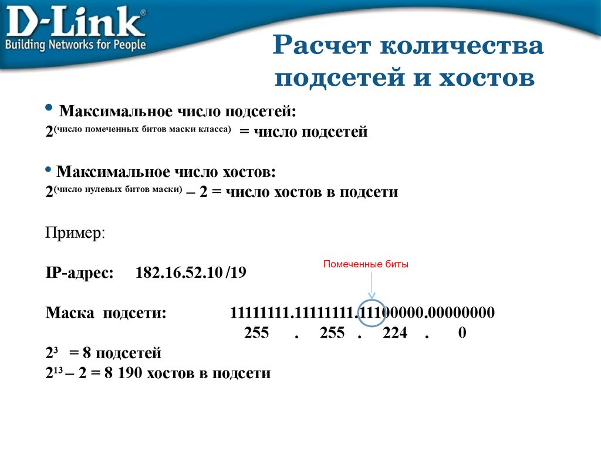

# Homework №5

## 1. Ответы на вопросы

- [answers](./result/answers.md)

- [Основы компьютерных сетей. Тема №5. Понятие IP адресации, масок подсетей и их расчет](https://habr.com/ru/articles/314484/)

- [Пример расчета количества хостов и подсетей на основе IP-адреса и маски](https://help.keenetic.com/hc/ru/articles/213965829-%D0%9F%D1%80%D0%B8%D0%BC%D0%B5%D1%80-%D1%80%D0%B0%D1%81%D1%87%D0%B5%D1%82%D0%B0-%D0%BA%D0%BE%D0%BB%D0%B8%D1%87%D0%B5%D1%81%D1%82%D0%B2%D0%B0-%D1%85%D0%BE%D1%81%D1%82%D0%BE%D0%B2-%D0%B8-%D0%BF%D0%BE%D0%B4%D1%81%D0%B5%D1%82%D0%B5%D0%B9-%D0%BD%D0%B0-%D0%BE%D1%81%D0%BD%D0%BE%D0%B2%D0%B5-IP-%D0%B0%D0%B4%D1%80%D0%B5%D1%81%D0%B0-%D0%B8-%D0%BC%D0%B0%D1%81%D0%BA%D0%B8)

## 2. Создать 2 ВМ: client и server

− Запретить входящий ICMP трафик на server с помощью IPTables
− Разрешить входящие SSH подключения к client только от server, через конфигурацию SSH

- [Как защитить ssh в CentOS / RHEL / Fedora](https://itsecforu.ru/2018/12/25/%D0%BA%D0%B0%D0%BA-%D0%B7%D0%B0%D1%89%D0%B8%D1%82%D0%B8%D1%82%D1%8C-ssh-%D0%B2-centos-rhel-fedora/)

## 3. Создать 2 ВМ: client и server

- Настроить OpenVPN server на server
- Настроить OpenVPN client на client, подключить его к серверу
- Настроить доступ клиента в Интернет только через подключение к серверу через OpenVPN

