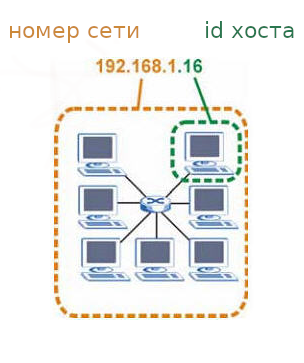
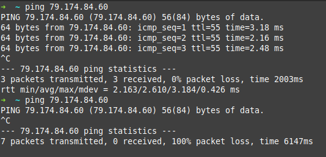

# Homework №5

## 1. Ответы на вопросы

- [answers](./result/answers.md)

- [Основы компьютерных сетей. Тема №5. Понятие IP адресации, масок подсетей и их расчет](https://habr.com/ru/articles/314484/)


- [Пример расчета количества хостов и подсетей на основе IP-адреса и маски](https://help.keenetic.com/hc/ru/articles/213965829-%D0%9F%D1%80%D0%B8%D0%BC%D0%B5%D1%80-%D1%80%D0%B0%D1%81%D1%87%D0%B5%D1%82%D0%B0-%D0%BA%D0%BE%D0%BB%D0%B8%D1%87%D0%B5%D1%81%D1%82%D0%B2%D0%B0-%D1%85%D0%BE%D1%81%D1%82%D0%BE%D0%B2-%D0%B8-%D0%BF%D0%BE%D0%B4%D1%81%D0%B5%D1%82%D0%B5%D0%B9-%D0%BD%D0%B0-%D0%BE%D1%81%D0%BD%D0%BE%D0%B2%D0%B5-IP-%D0%B0%D0%B4%D1%80%D0%B5%D1%81%D0%B0-%D0%B8-%D0%BC%D0%B0%D1%81%D0%BA%D0%B8)

## 2. Создать 2 ВМ: client и server

- Запретить входящий ICMP трафик на server с помощью IPTables
- Разрешить входящие SSH подключения к client только от server, через конфигурацию SSH

### ICMP

- [Как защитить ssh в CentOS / RHEL / Fedora](https://itsecforu.ru/2018/12/25/%D0%BA%D0%B0%D0%BA-%D0%B7%D0%B0%D1%89%D0%B8%D1%82%D0%B8%D1%82%D1%8C-ssh-%D0%B2-centos-rhel-fedora/)

- ICMP (Internet Control Message Protocol) — сетевой протокол, входящий в стек протоколов TCP/IP.
- Основная цель ICMP — передача сообщений об ошибках и других исключительных ситуациях, возникших при передаче данных. Например, запрашиваемая услуга недоступна или хост или маршрутизатор не отвечают. Также на ICMP возлагаются некоторые сервисные функции.
- [Протокол ICMP](./net_LS-10RU_icmp.pdf)

### iptables

- ```sudo iptables -L``` - текущие правил
- ```sudo iptables -A INPUT -p icmp -j DROP``` - все типы запросов
- Блокировка по типам запросов
- ```sudo iptables -A INPUT -p icmp --icmp-type echo-request -j DROP```
- ```iptables -A INPUT -p icmp --icmp-type destination-unreachable -j DROP```


### Просмотр интерфейсов

```
ifconfig
ip link show
ip addr show
ip a
```

### Настройки sysctl.conf

```
sudo nano /etc/sysctl.conf
net.ipv4.icmp_echo_ignore_all = 1 # тип ping
sudo sysctl -p
```

### Test ping


- [iptables.log](./result/iptables.log)

### SSH settings

```
sudo vim /etc/ssh/sshd_config
AllowUsers *@server_ip
sudo systemctl restart sshd
scp root@91.197.98.75:/etc/ssh/sshd_config /.
```

## 3. Создать 2 ВМ: client и server

- Настроить OpenVPN server на server
- Настроить OpenVPN client на client, подключить его к серверу
- Настроить доступ клиента в Интернет только через подключение к серверу через OpenVPN